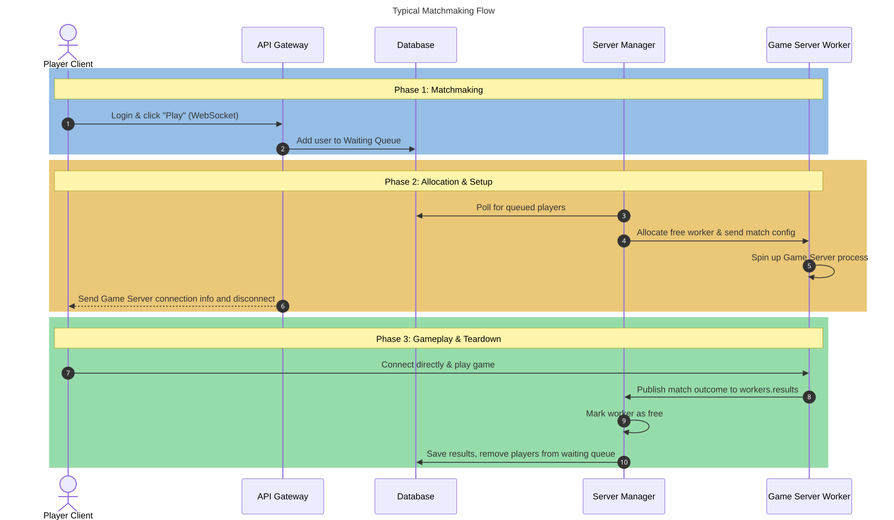

# Architecture

## Prerequisites

Goal of this project is to run game multiplayer matchmaking for user-provided game server.
Frontend exposes API for game server client to interact with the server 
and provide web-based matchmaking functionality.
Where other parts handle matchmaking logic and game server management.

Due to contributors' time limitations it is targeted for running on a single machine.
Future versions may modify this to work on multiple machines.

## Components

### Frontend + API
- Powered by SvelteKit.
- Serves the website and exposes REST endpoints.
- Handles user registration, login, and session management.
- Manages user connections waiting for matchmaking and stores their state in the DB.

### DB
- PostgreSQL.
- Stores all persistent data (users, queue, matches, etc.).

### Server Manager
- Powered by Go.
- Splits up into two parts:
    1. Matchmaker
        - Fetches users waiting for matches from the DB queue.
        - Creates match and assigns user to it in database.
        - Hands over the match execution to ServerManager
    2. ServerManager
        - Spawns game-server worker containers and manages their lifecycle.
        - Sends match assignments to workers and handles their results.
        - Saves match results to the DB.
    - Why split?
        - It is done so both parts don't need to communicate with each other across containers,
        which would introduce increased code complexity and potential bugs.
        - The tradeoff is that the two parts are coupled and one can crash another.
- Exposed to the Docker socket (for reason why see [Docker section](#docker)).

### Game Server
- Powered by Go.
- Wraps the actual game server process and manages its lifecycle.
- Responds to health pings and assignments via message broker.
- Publishes results to broker.

### NATS
- Message broker for communication between server manager and game servers.

## Docker

The project uses a Docker-based architecture where all services run as containers.

While most services are managed by Docker Compose, the game-server must be spawned manually by the server-manager. This gives the server-manager direct control over the game-server lifecycle — a key requirement when handling failures. To achieve this, the server-manager has access to the Docker socket, a powerful privilege that is dangerous in general but necessary here: it lets the server-manager inspect and restart any game-server the moment a failure is detected.

The server-manager also needs to know the exact state of every game-server container at all times. This allows it to cancel matches on affected servers properly and, in turn, unblock matchmaking for the users of those matches.

## NATS

### Subjects

- `workers.health`
    - Type: request/reply
    - Direction: server manager → workers
    - Purpose: health check ping. Workers reply with their container ID.
- `workers.assign.<worker_id>`
    - Type: request/reply
    - Direction: server manager → worker
    - Purpose: match assignment with match config. Worker acknowledges by reply.
- `workers.results`
    - Type: JetStream (stream `RESULT`)
    - Direction: worker → server manager
    - Purpose: durable match result stream.

### Payloads

#### Assign Payload

Used in worker assign subject for match assignments.

```json
{"matchID": 1234, "config": {...}}
```
- `matchID`: unique identifier of the match.
- `config`: match-specific config data used by the actual game server.

#### Result Payload

Used in worker results subject for handing match results to the server manager.

```json
{"matchID": 1234, "success": true, "details": {}}
```
- `matchID`: unique identifier of the match.
- `success`: `true` when the match completed, `false` when canceled.
- `details`: match-specific result data in JSON. Empty object on cancellation.

## Waiting Queue

### Storage

Waiting queue is only an abstract concept, database really just stores 
a few fields per user instead of full-fledged queue table.

Each user in database holds `match_id` and `queued_until` fields.
Depending on their values they signal different state in waiting queue.

1. `match_id` is not null
    - User is currently in a match.
2. `match_id` is null and `queued_until` is date now or in the future, 
    - User is waiting in the queue.
3. `match_id` is null and `queued_until` is null or is a past date, 
    - User is inactive.

The reason why `queued_until` is used, is to prevent API crashes from 
leaving dead users in waiting queue.

### Usage

1. API
    - When user connects to API it handles updating those fields. 
    - It sets `queued_until` to the current time plus a timeout. 
    - The timeout should be short but not too short to avoid user changing its queue status randomly.

2. Server-manager
    - Handles matchmaking by polling waiting users from DB and assigning them to matches. 
    - To assign somebody he sets `match_id` value to specific id and `queued_until` to null. 
    - Also server-manager sets all users to inactive state on startup.

## Matchmaking Flow


